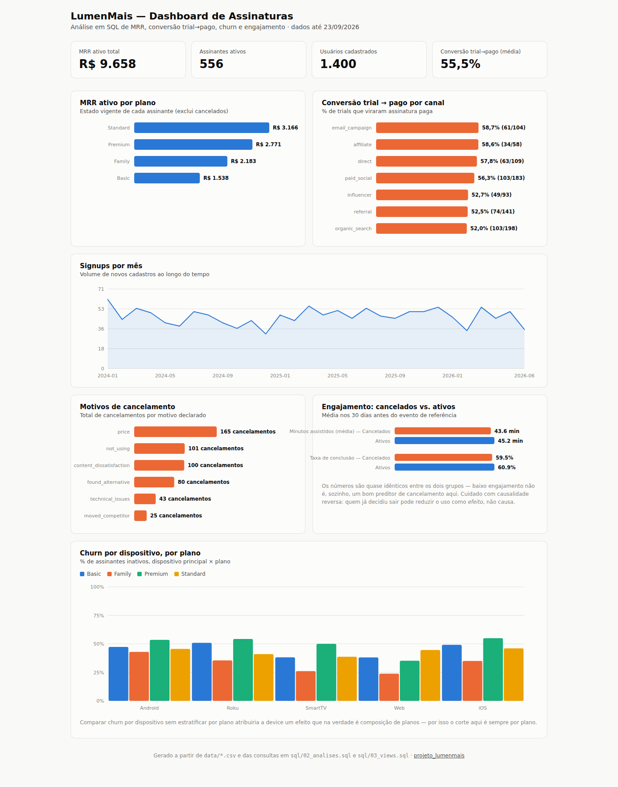
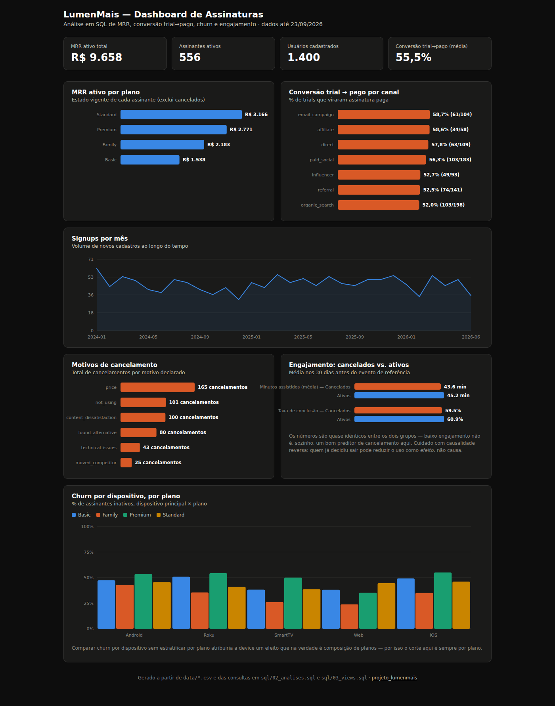

# LumenMais — Análise de Assinatura SaaS

Análise em SQL de dados de assinatura de um SaaS fictício de streaming (LumenMais): MRR, churn, conversão trial→pago e segmentação por canal de aquisição e dispositivo, respondendo perguntas de negócio reais de três stakeholders (CFO, Growth, Product). Dados fictícios, gerados para fins de estudo e portfólio.

## Dashboard

`dashboard.html` é um painel interativo (HTML/CSS/JS puro, sem dependências) com quatro blocos de indicadores:

**Receita**
- MRR ativo total e por plano (Basic, Standard, Premium, Family)
- Número de assinantes ativos por plano

**Aquisição e conversão**
- Evolução mensal de signups
- Taxa de conversão trial → pago, geral e por canal de aquisição

**Retenção e churn**
- Distribuição dos motivos de cancelamento
- Churn por dispositivo, estratificado por plano

**Engajamento**
- Comparação de minutos assistidos e taxa de conclusão de conteúdo entre usuários cancelados e ativos, nos 30 dias anteriores ao evento




Como o GitHub não renderiza HTML diretamente, baixe o arquivo e abra no navegador para interagir com ele (ou sirva a pasta com GitHub Pages).

## Visão geral do projeto

O projeto simula uma instituição de streaming (LumenMais) que precisa responder perguntas de três áreas diferentes a partir do mesmo conjunto de dados brutos: usuários, eventos de assinatura (trial, upgrade, downgrade, cancelamento) e eventos de uso (sessões assistidas). As perguntas de negócio completas — com métrica, técnica de SQL, output esperado e a armadilha de análise a evitar em cada uma — estão documentadas em [`docs/perguntas_stakeholders.md`](docs/perguntas_stakeholders.md). Em resumo, o projeto responde:

- Qual é a receita recorrente (MRR) hoje e como ela se divide por plano?
- Qual a taxa de conversão trial → pago, geral e por canal de aquisição?
- Como o volume de signups evoluiu por canal ao longo do tempo?
- Algum canal de aquisição converte melhor e retém mais que os outros?
- O tipo de dispositivo influencia a retenção, controlando por plano?
- Por que os usuários cancelam, e isso varia por plano?
- Engajamento baixo é um sinal de alerta de churn?

## Principais resultados

| Indicador | Resultado |
|---|---|
| Usuários cadastrados | 1.400 |
| Assinantes ativos | 556 |
| MRR ativo total | R$ 9.658,44 |
| Conversão trial → pago (geral) | 55,0% (487 de 886 trials) |
| Melhor canal de conversão | email_campaign (58,7%) |
| Pior canal de conversão | organic_search (52,0%) |
| Principal motivo de cancelamento | Preço (165 ocorrências) |
| Engajamento pré-cancelamento (min. médios) | 43,6 min (cancelados) vs. 45,2 min (ativos) |

O MRR está concentrado no plano Standard (R$ 3.166,02 / 198 assinantes), seguido por Premium (R$ 2.770,74 / 126) e Family (R$ 2.183,22 / 78) — o plano Basic tem mais assinantes que o Family (154), mas contribui menos receita por ter o menor ticket. A diferença de engajamento entre quem cancela e quem permanece ativo é pequena (menos de 2 minutos e 1,4 p.p. de completion rate), o que é consistente com a armadilha de causalidade reversa apontada em `docs/perguntas_stakeholders.md`: baixo engajamento pode ser efeito, não causa, da decisão de cancelar.

## Arquitetura da solução

```
Dados fictícios (CSV)
        │
        ▼
Schema relacional (PostgreSQL) ── sql/01_schema.sql
        │
        ▼
Consultas analíticas ── sql/02_analises.sql
        │              (MRR, conversão trial→pago, engajamento)
        ▼
Views consolidadas ── sql/03_views.sql
        │              (vw_usage_summary, vw_subscriber_current_state,
        │               vw_dashboard_master)
        ▼
Reprodução em Python/pandas ── analyze.py
        │              (mesma lógica das consultas, para gerar os dados
        │               do dashboard sem depender de um servidor Postgres)
        ▼
dashboard.html (HTML/CSS/JS puro)
```

### Responsabilidade de cada camada

**SQL (PostgreSQL)**
- Define o modelo relacional e as chaves estrangeiras entre usuários, eventos de assinatura e eventos de uso
- Reconstrói o estado vigente de cada assinante a partir do histórico de eventos via window function
- Consolida as reconstruções em views prontas para consumo por dashboard/BI

**Python (pandas)**
- Reproduz localmente a mesma lógica das consultas SQL (reconstrução de estado, joins temporais) para gerar os números do dashboard, já que o projeto não depende de um servidor PostgreSQL provisionado
- Exporta o resultado como JSON, consumido diretamente pelo dashboard

**Dashboard (HTML/JS)**
- Renderiza os indicadores em gráficos interativos, com tooltip, legenda e alternância entre modo claro e escuro, sem nenhuma dependência externa

## Modelagem do banco de dados

```
   USERS                    SUBSCRIPTION_EVENTS
┌───────────────┐          ┌──────────────────────┐
│ user_id    PK │─────┐    │ event_id         PK  │
│ signup_date   │     │    │ user_id      FK ─────┼──┐
│ acquisition_..│     └───▶│ event_date           │  │
│ country       │  1     N │ event_type           │  │
│ primary_device│          │ plan                 │  │
│ had_trial     │          │ mrr_impact           │  │
└───────────────┘          │ cancel_reason        │  │
        │                  └──────────────────────┘  │
        │ 1                                             │
        │ N                                             │
        ▼                                               │
┌────────────────────┐                                 │
│ USAGE_EVENTS        │                                │
│ usage_id        PK │                                │
│ user_id      FK ────┼────────────────────────────────┘
│ session_date       │
│ device             │
│ genre              │
│ watch_minutes      │
│ completed_content  │
└────────────────────┘
```

| Tabela | Finalidade |
|---|---|
| `users` | Cadastro: data de inscrição, canal de aquisição, país, dispositivo principal, se passou por trial |
| `subscription_events` | Histórico de eventos de assinatura (trial_start, trial_churn, subscription_start, upgrade, downgrade, cancellation), com o plano e o impacto em MRR de cada evento |
| `usage_events` | Sessões de uso: dispositivo, gênero assistido, minutos assistidos, se completou o conteúdo |

`subscription_events` e `usage_events` guardam histórico completo (uma linha por evento) — o estado atual de cada assinante não é uma coluna, é reconstruído via `ROW_NUMBER() OVER (PARTITION BY user_id ORDER BY event_date DESC)`, pegando o evento mais recente de cada usuário. Essa é a técnica central do projeto: somar `mrr_impact` bruto de todos os eventos infla o MRR, porque conta cancelamentos e reativações como receita adicional.

## SQL desenvolvido

**`sql/01_schema.sql`** — cria as três tabelas relacionais com chaves primárias e estrangeiras, `NOT NULL` nas colunas obrigatórias e índices nas colunas usadas para join (`user_id` em `subscription_events` e `usage_events`).

**`sql/02_analises.sql`** — as consultas analíticas de negócio:
- MRR ativo total e por plano, via window function
- Conversão trial → pago, geral e por canal de aquisição
- Engajamento pré-cancelamento, comparando cancelados e ativos nos 30 dias anteriores ao evento

```sql
WITH ultimo_evento AS (
  SELECT
    se.*,
    ROW_NUMBER() OVER (
      PARTITION BY user_id
      ORDER BY event_date DESC, event_id DESC
    ) AS rn
  FROM subscription_events se
  WHERE event_type NOT IN ('trial_start', 'trial_churn')
)
SELECT
  plan,
  COUNT(*) AS assinantes_ativos,
  SUM(mrr_impact) AS mrr_total
FROM ultimo_evento
WHERE rn = 1
  AND event_type <> 'cancellation'
GROUP BY plan
ORDER BY mrr_total DESC;
```

**`sql/03_views.sql`** — consolida as reconstruções de estado em três views:

```sql
CREATE OR REPLACE VIEW vw_subscriber_current_state AS
WITH ranked_events AS (
  SELECT se.*,
    ROW_NUMBER() OVER (
      PARTITION BY user_id
      ORDER BY event_date DESC, event_id DESC
    ) AS rn
  FROM subscription_events se
  WHERE event_date <= CURRENT_DATE
),
current_state AS (
  SELECT user_id, event_date AS last_event_date, event_type AS last_event_type,
    plan AS current_plan,
    CASE WHEN event_type = 'cancellation' THEN 0 ELSE mrr_impact END AS current_mrr,
    cancel_reason
  FROM ranked_events
  WHERE rn = 1 AND event_type NOT IN ('trial_start', 'trial_churn')
)
SELECT cs.*, u.signup_date, u.acquisition_channel, u.country, u.primary_device, u.had_trial,
  CASE WHEN cs.last_event_type = 'cancellation' THEN FALSE ELSE TRUE END AS is_active
FROM current_state cs
JOIN users u ON u.user_id = cs.user_id;
```

- `vw_usage_summary` — sessões, minutos médios e completion rate por usuário
- `vw_subscriber_current_state` — estado vigente de cada assinante (a query acima)
- `vw_dashboard_master` — junta as duas views anteriores, pronta para alimentar um dashboard/BI

## Decisões técnicas

- PostgreSQL como referência de modelagem por ser o SGBD mais comum em vagas de dados no mercado brasileiro
- Reconstrução de estado via `ROW_NUMBER()` em vez de somar `mrr_impact` bruto, para não contar cancelamentos e reativações como receita adicional
- Chaves estrangeiras explícitas (`REFERENCES`) entre `users` e as duas tabelas de eventos, para garantir integridade referencial
- Índices em `user_id` nas tabelas de eventos, já que é a coluna usada em praticamente todo join do projeto
- Separação entre consultas analíticas (`02_analises.sql`, exploratórias) e views (`03_views.sql`, prontas para consumo por dashboard/BI)
- Dashboard construído em HTML/CSS/JS puro, sem framework, para não depender de instalação nem de um servidor Postgres provisionado — os dados são pré-calculados em `analyze.py` e embutidos como JSON
- `LEFT JOIN` (não `INNER JOIN`) na reconstrução de conversão trial→pago, para não descartar trials que ainda não tiveram nenhum evento seguinte
- `NOT IN ('trial_start', 'trial_churn')` para isolar o estado de assinatura paga do estado de trial, que segue uma lógica diferente

## Tecnologias utilizadas

| Tecnologia | Aplicação |
|---|---|
| PostgreSQL | Modelagem relacional, consultas analíticas e views |
| SQL | Window functions, CTEs, self-joins temporais |
| Python (pandas) | Reprodução da lógica das consultas para gerar os dados do dashboard |
| HTML / CSS / JS | Dashboard interativo, sem dependências externas |
| Git / GitHub | Versionamento e portfólio |

## Estrutura do repositório

```
projeto_lumenmais/
├── data/                          # Dados brutos (CSV)
│   ├── users.csv
│   ├── usage_events.csv
│   └── subscription_events.csv
├── docs/
│   └── perguntas_stakeholders.md  # Perguntas de negócio, por complexidade analítica
├── imagens/
│   ├── dashboard_light.png
│   └── dashboard_dark.png
├── sql/
│   ├── 01_schema.sql              # Criação das tabelas
│   ├── 02_analises.sql            # Consultas de MRR, conversão e engajamento
│   └── 03_views.sql               # Views prontas para consumo por dashboard/BI
├── dashboard.html                 # Dashboard interativo com os principais indicadores
├── LICENSE
└── README.md
```

## Como explorar o projeto

**SQL** — ordem recomendada: `01_schema.sql` (cria as tabelas) → importe os CSVs de `data/` nas tabelas correspondentes → `02_analises.sql` (consultas exploratórias) → `03_views.sql` (views consolidadas).

**Dashboard** — baixe `dashboard.html` e abra no navegador (ou sirva a pasta com GitHub Pages); não precisa de banco de dados rodando, os dados já vêm embutidos no arquivo.

**Perguntas de negócio** — [`docs/perguntas_stakeholders.md`](docs/perguntas_stakeholders.md) documenta cada pergunta com métrica, técnica de SQL, output esperado e armadilha de análise a evitar.

## Competências demonstradas

- Modelagem relacional com chaves primárias e estrangeiras
- Reconstrução de estado a partir de histórico de eventos via window functions (`ROW_NUMBER() OVER PARTITION BY`)
- CTEs encadeadas e self-joins temporais (janela de 30 dias antes de um evento)
- Consolidação de consultas exploratórias em views reutilizáveis
- Tradução de perguntas de negócio (CFO, Growth, Product) em métricas e técnicas de SQL específicas
- Identificação e prevenção de armadilhas analíticas comuns (métrica inflada, causalidade reversa, confounders)
- Construção de dashboard interativo sem dependências externas (HTML/CSS/JS puro)
- Documentação técnica orientada a stakeholder, não só a código

## Observações

- Todos os dados são fictícios, gerados para fins de estudo e portfólio
- O projeto não depende de um servidor PostgreSQL provisionado: o SQL documenta a modelagem e as consultas, e `analyze.py` reproduz a mesma lógica em Python para alimentar o dashboard
- Nenhuma credencial é necessária para explorar o projeto
- Objetivo: demonstrar raciocínio analítico e SQL aplicado a um problema de negócio real, com fonte de dados própria e documentação reprodutível
